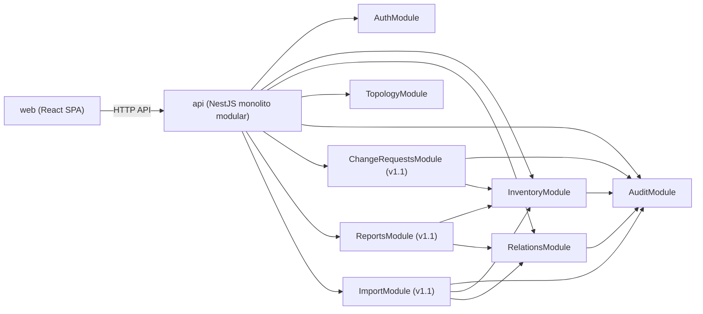
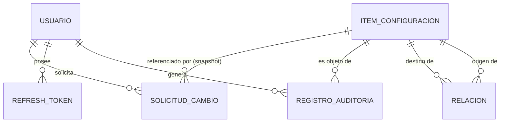
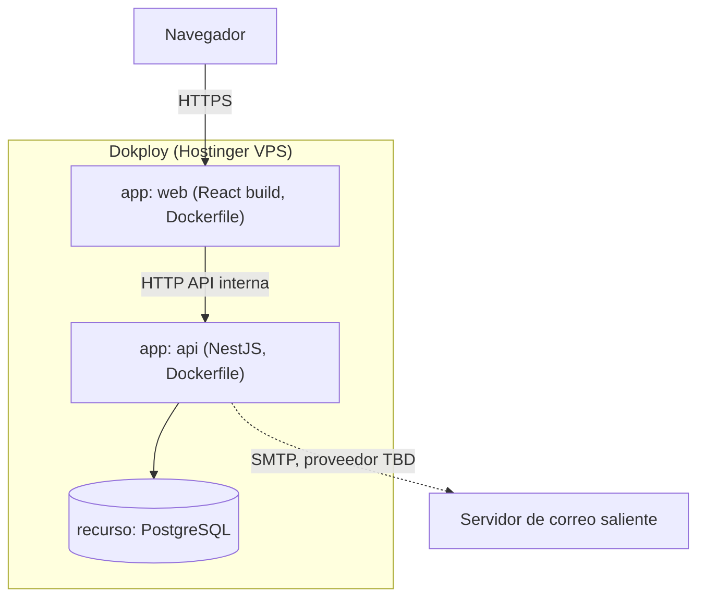

# Architecture Spine — TestOS

## Design Paradigm

**Monolito modular.** Un solo backend deployable (NestJS), dividido en módulos de dominio que espejan las features del PRD. Cada módulo es su propio límite de dependencia — expone solo lo que exporta explícitamente; nada accede al repositorio/servicio interno de otro módulo por la puerta de atrás. Elegido sobre microservicios completos: no hay necesidad real de escalar u operar componentes independientes para un solo builder en un VPS pequeño, y los límites de módulo ya dejan la puerta abierta a separar en servicios más adelante sin rediseñar (ver Deferred).



## Invariants & Rules

### AD-1 — Monolito modular con un dueño por entidad
- **Binds:** all
- **Prevents:** microservicios prematuros; módulos con fronteras difusas; y, específicamente, que dos módulos escriban la misma tabla por caminos distintos porque `PrismaService` es un singleton inyectable en cualquier parte (p. ej. edición directa vía InventoryModule vs. aprobación de un cambio vía ChangeRequestsModule tocando `ItemConfiguracion` sin pasar por Inventory).
- **Rule:** el backend es un único deployable NestJS dividido en módulos de dominio (Auth, Inventory, Relations, Topology, Audit, y en v1.1: ChangeRequests, Reports, Import). Cada entidad tiene exactamente un módulo dueño que es el único que inyecta `PrismaService` para escribirla: `ItemConfiguracion`→Inventory, `Relacion`→Relations, `RegistroAuditoria`→Audit, `SolicitudCambio`→ChangeRequests, `Usuario`/`RefreshToken`→Auth. Cualquier otro módulo que necesite crear, modificar o eliminar esa entidad lo hace llamando a un método exportado del servicio del módulo dueño — nunca inyectando `PrismaService` para escribirla directamente. Lectura vía `PrismaService` propio está permitida donde el PRD ya lo pide (p. ej. ReportsModule leyendo Inventory/Relations); escritura no.

### AD-2 — Frontera API entre frontend y backend
- **Binds:** web, api
- **Prevents:** acoplar el SPA al esquema de base de datos o a código de servidor — rompería poder desplegar `web` y `api` como dos aplicaciones Dokploy independientes.
- **Rule:** `web` solo se comunica con `api` vía la API HTTP pública (REST). Ningún acceso directo a Postgres ni a código del backend desde el build del frontend.

### AD-3 — Atomicidad de auditoría, con forma de payload canónica *(implementa FR-28 a FR-30 del PRD)*
- **Binds:** InventoryModule, RelationsModule, ChangeRequestsModule, ImportModule (todo módulo que escriba sobre ítems, relaciones o solicitudes)
- **Prevents:** una escritura de inventario que quede sin su registro de auditoría por fallo parcial o por depender de un proceso asíncrono separado que pueda fallar en silencio.
- **Rule:** toda escritura de dominio y su registro de auditoría correspondiente ocurren dentro de la misma transacción de base de datos (`prisma.$transaction`). El cliente de transacción (`Prisma.TransactionClient`) se pasa explícitamente como parámetro a `AuditModule.record(tx, ...)` y a cualquier otra llamada entre módulos que ocurra dentro de esa escritura — un módulo que llame a otro durante una operación auditada nunca abre su propia transacción de nivel superior para esa llamada; siempre reutiliza la que recibió. Nunca vía cola/evento asíncrono para el registro de auditoría del Núcleo v1 o Extendido v1.1. `AuditModule.record()` exige una forma de payload única (`{ usuario, tipoAccion, entidad, entidadId, cambios, fecha }`) — ningún módulo inventa su propia forma de reportar el cambio, para que ReportsModule (v1.1) pueda leer auditoría de cualquier módulo sin casos especiales. Única excepción (implementa FR-29): durante una reimportación masiva completa (ImportModule), la limpieza del inventario anterior puede saltar el registro de auditoría por ítem individual — la propia corrida de importación queda auditada como un evento único, no ítem por ítem.

### AD-4 — RBAC como guard declarativo
- **Binds:** todos los endpoints de `api`
- **Prevents:** checks de permiso dispersos e inconsistentes, repetidos a mano en cada handler.
- **Rule:** cada endpoint declara los roles permitidos con un decorador (`@Roles(...)`), resuelto por un guard global. Ningún handler valida rol con un `if` manual sobre el usuario.

### AD-5 — Autenticación: JWT + refresh rotation con revocación persistida `[ADOPTED]`
- **Binds:** AuthModule
- **Prevents:** sesiones que no puedan revocarse explícitamente pese a que el PRD lo exige (NFR Seguridad — logout y cambio de contraseña deben invalidar de inmediato).
- **Rule:** access token JWT de vida corta (`[ASSUMPTION: 15 minutos]`); refresh token opaco persistido en Postgres (tabla `RefreshToken`: usuario, hash del token, expiración, revocado), rotado en cada uso, con detección de reuso (un refresh token ya usado que vuelve a presentarse revoca toda la cadena). Logout o cambio de contraseña revoca el refresh token activo de inmediato — el access token JWT vive lo bastante corto para que su no-revocabilidad intrínseca no importe en la práctica.

### AD-6 — Instancia única, sin multi-tenant `[ADOPTED]`
- **Binds:** all
- **Prevents:** modelar `tenant_id` o aislamiento por organización que el PRD no pide, complicando el esquema sin necesidad real.
- **Rule:** no existe entidad Organización/Tenant en el modelo de datos. Un despliegue de TestOS sirve a una sola organización; los roles (Administrador/Gestor/Editor/Consulta) son globales a la instancia, tal como los definió el PRD.

### AD-7 — Config y secretos vía entorno, nunca en el repo
- **Binds:** all
- **Prevents:** secretos hardcodeados o committeados, y despliegues no reproducibles entre entornos.
- **Rule:** toda configuración sensible (cadena de conexión a Postgres, secreto de firma JWT, credenciales SMTP) se lee de variables de entorno inyectadas por Dokploy en runtime. El repositorio versiona únicamente `.env.example`; ningún `.env` real se comitea.

### AD-8 — Propiedades dinámicas por tipo de ítem: columna JSONB *(implementa FR-13, FR-14 del PRD)*
- **Binds:** InventoryModule
- **Prevents:** que InventoryModule y cualquier módulo que lea/escriba propiedades de ítem (ImportModule, ReportsModule) elijan formas de dato incompatibles para lo mismo — JSONB vs. tabla EAV vs. una tabla por tipo son todas consistentes con "propiedades dinámicas" si no se fija una sola.
- **Rule:** `ItemConfiguracion` tiene una columna `properties` de tipo `jsonb` en Postgres para los atributos específicos del tipo; los campos comunes (nombre, descripción, dominio propietario, dirección de red) son columnas normales. Agregar un tipo de ítem nuevo (FR-13) es agregar una entrada a un catálogo de tipos, nunca una migración de esquema.

### AD-9 — Correo saliente: módulo común con timeout y degradación no bloqueante *(implementa NFR Resiliencia del PRD §10)*
- **Binds:** AuthModule (FR-2, FR-5, FR-7), ChangeRequestsModule (FR-32, FR-35, v1.1)
- **Prevents:** que un módulo bloquee su flujo principal esperando al servidor de correo mientras otro lo maneja distinto — el PRD exige degradación controlada, no solo "algún" proveedor SMTP.
- **Rule:** todo envío de correo pasa por un `MailModule` común (no cada módulo llama a un cliente SMTP por su cuenta), con timeout configurable vía variable de entorno y fallo no bloqueante: si el envío falla o excede el timeout, la operación de negocio que lo disparó (login, invitación, solicitud de cambio) igual se completa, y el fallo de correo solo se loggea.

## Consistency Conventions

| Concern | Convention |
| --- | --- |
| Naming (entities, files, interfaces, events) | TypeScript en camelCase; columnas Postgres en snake_case (mapeadas vía `@map` de Prisma). IDs = UUID v4 en toda entidad. Un módulo de NestJS por dominio, nombrado igual que la feature del PRD (`inventory`, `relations`, `topology`, `audit`, `change-requests`, `reports`, `import`). Un solo controller por entidad (el del módulo dueño, AD-1) — ningún módulo expone un endpoint alterno sobre una entidad que no le pertenece, aunque sea de solo lectura, para que RBAC no tenga dos puertas con visibilidad distinta hacia el mismo recurso. |
| Data & formats (ids, dates, error shapes, envelopes) | Fechas en ISO-8601 UTC. Errores HTTP en el formato default de NestJS (`{ statusCode, message, error }`). Listados paginados como `{ data, total, page, pageSize }` (implementa FR-17 / `[ASSUMPTION]` pageSize=50). Email de usuario y nombre de ítem se normalizan a mayúsculas antes de comparar o persistir, en un único punto (helper compartido en `common/`) — nunca cada módulo con su propia normalización (implementa la NFR de consistencia de datos del PRD §10; afecta AuthModule y InventoryModule). |
| State & cross-cutting (mutation, errors, logging, config, auth) | Las mutaciones de dominio solo ocurren en la capa de servicio de cada módulo — ningún controller llama a Prisma directamente. Logging estructurado (JSON) a stdout, recogido por Dokploy. Auth y RBAC vía guards globales (AD-4, AD-5), nunca lógica ad hoc por endpoint. Arranque: `api` verifica la conexión a Postgres (health check) antes de aceptar tráfico — implementa la NFR de Disponibilidad del PRD §10. |

## Stack

| Name | Version |
| --- | --- |
| TypeScript | 5.x |
| Node.js | 24 (Active LTS) |
| NestJS | 11 — `[ASSUMPTION]` deliberadamente no la 12 (liberada 2026-08-27, ~2 semanas antes de esta espina): migración completa a ESM + Vitest/oxlint/Rspack es un cambio grande y reciente, con menos contenido/tutoriales maduros para un ejercicio de aprendizaje asistido por agentes de IA. Revisar en una actualización futura de esta espina. |
| Prisma | 7 (7.10.x) — no la 8: verificado 2026-09-11, Prisma 8 sigue en release candidate (8.0.0-rc.x), no apta para fijar como stack |
| PostgreSQL | 18.x (última estable verificada: 18.6) — sujeto a qué versión provisione el recurso de base de datos de Dokploy al desplegar |
| React | 19 |
| Vite | 8.x (con Rolldown) |
| XyFlow (antes React Flow) | última estable — visualización de topología (FR-23 a FR-26) |

## Structural Seed

### Árbol de fuente

```text
testos/
  apps/
    api/                    # NestJS — monolito modular (backend)
      src/
        auth/               # AuthModule: login, sesión JWT+refresh, RBAC, invitaciones, bootstrap admin
        inventory/          # InventoryModule: ítems de configuración
        relations/          # RelationsModule
        topology/           # TopologyModule
        audit/              # AuditModule
        change-requests/    # ChangeRequestsModule (Extendido v1.1)
        reports/            # ReportsModule (Extendido v1.1)
        import/             # ImportModule (Extendido v1.1)
        common/             # guards, decoradores (@Roles), interceptors, filtros de error compartidos
      prisma/
        schema.prisma
    web/                    # React + Vite (SPA)
      src/
        features/           # un directorio por feature, espejo del backend
        api-client/         # cliente HTTP tipado hacia la API de `api`
  docker/
    api.Dockerfile
    web.Dockerfile
  docker-compose.yml        # referencia para desarrollo local; en Dokploy, `api` y `web` son dos aplicaciones separadas
```

### Modelo de datos (entidades núcleo — nombres y relaciones, no atributos completos)



### Despliegue y entornos



Todo secreto (cadena de conexión, `JWT_SECRET`, credenciales SMTP) vive como variable de entorno en el panel de Dokploy — nunca en el repositorio (AD-7). No hay entorno de staging definido en este ejercicio: un solo entorno de producción en Hostinger. Backups/DR de Postgres: fuera de alcance de este spine (ver Deferred).

## Capability → Architecture Map

| Capability / Área (PRD) | Vive en | Gobernado por |
| --- | --- | --- |
| 4.1 Autenticación, sesión, RBAC (FR-1 a FR-11) | `apps/api/src/auth` | AD-4, AD-5, AD-6, AD-7, AD-9 |
| 4.2 Inventario de ítems (FR-12 a FR-17) | `apps/api/src/inventory` | AD-1, AD-3, AD-8 |
| 4.3 Relaciones entre ítems (FR-18 a FR-22) | `apps/api/src/relations` | AD-1, AD-3 |
| 4.4 Topología (FR-23 a FR-26) | `apps/api/src/topology` | AD-1 |
| 4.5 Auditoría inmutable (FR-27 a FR-30) | `apps/api/src/audit` | AD-3 |
| 4.6 Solicitudes de cambio — v1.1 (FR-31 a FR-37) | `apps/api/src/change-requests` | AD-1, AD-3, AD-9 |
| 4.7 Reportes y exportación — v1.1 (FR-38, FR-39) | `apps/api/src/reports` | AD-1, AD-8 |
| 4.8 Importación masiva — v1.1 (FR-40 a FR-42) | `apps/api/src/import` | AD-1, AD-3, AD-8 |
| SPA / UI de todo lo anterior | `apps/web` | AD-2 |

## Deferred

- **Integración con CMDB externo** (RF-45..51, Diferido en el PRD) — módulo futuro `external-cmdb`; si se generaliza a múltiples orígenes o se queda atado a un conector tipo iTop es la pregunta abierta #5 del PRD, no decidida aquí.
- **Asistente conversacional de IA** (RF-52..55, Diferido) — proveedor de IA no decidido; depende de qué exista disponible cuando se retome esa capa.
- **Preferencias de usuario, notificaciones push, analítica de uso** (RF-56..61, Diferido) — sin mecanismo decidido (p. ej. push vía Web Push API vs. proveedor tercero).
- **Panel de administración de plataforma** (RF-62..63, Diferido).
- **Proveedor de correo saliente (SMTP) específico** — no decidido; `MailModule` (AD-9) solo asume un cliente SMTP genérico configurable vía variables de entorno (host, puerto, credenciales). Elegir proveedor es una decisión de despliegue, no de arquitectura.
- **Separación futura en servicios independientes** — si las NFR de Aislamiento de datos/Escalabilidad (PRD §10) lo exigen algún día, AD-1 ya deja los módulos con fronteras limpias para pelarlos sin rediseño; no se decide ahora porque no hay necesidad real todavía.
- **Backups y recuperación ante desastres de PostgreSQL en Hostinger/Dokploy** — fuera de alcance de este ejercicio; señalado para no perderlo de vista si esto llegara a importar datos reales algún día.
- **Entornos de staging/CI** — un solo entorno de producción por ahora; no se define pipeline de CI/CD en este spine.
- **Concurrencia sobre `ItemConfiguracion` compartido** — un ítem puede editarse directo (InventoryModule) y a la vez tener una solicitud de cambio en curso (ChangeRequestsModule, v1.1) sobre el mismo ítem. No se fija aquí un mecanismo de bloqueo optimista (p. ej. columna `version`) — se revisa si hace falta cuando se construya ChangeRequestsModule, dado que en Núcleo v1 (sin solicitudes de cambio todavía) no aplica.
- **Actualización de esta espina cuando NestJS 12 madure** — hoy se fija deliberadamente NestJS 11 (ver Stack) por lo reciente de la 12; revisar el pin en una futura pasada de `bmad-architecture` (intención Update) una vez haya más adopción/tutoriales.
